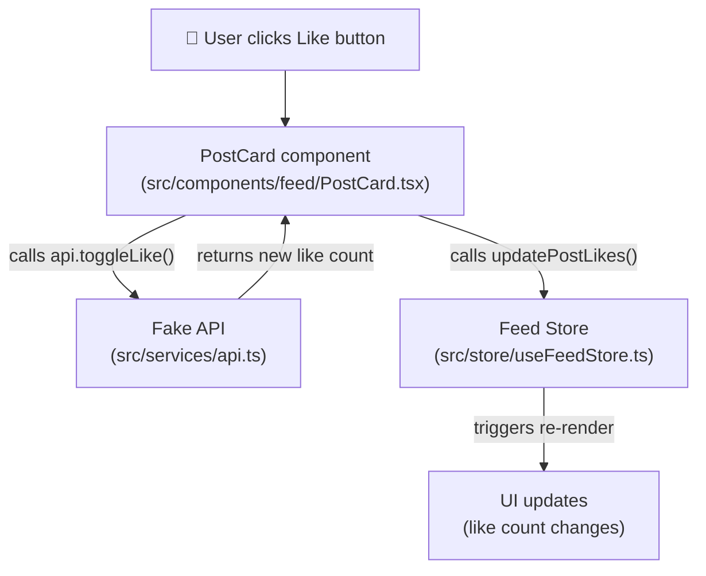
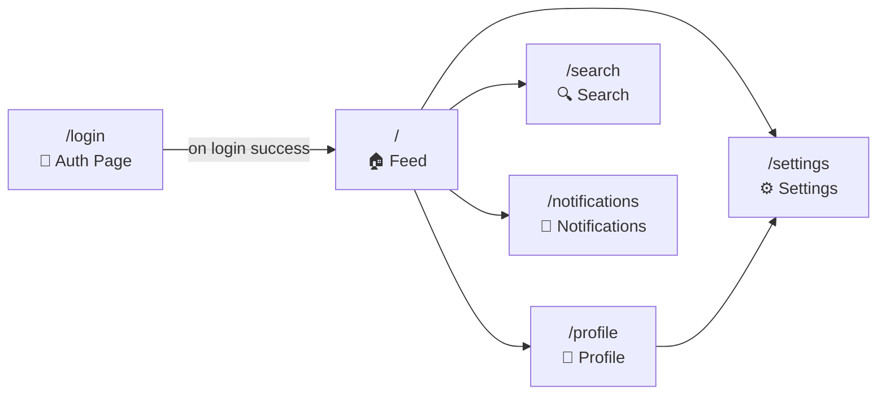
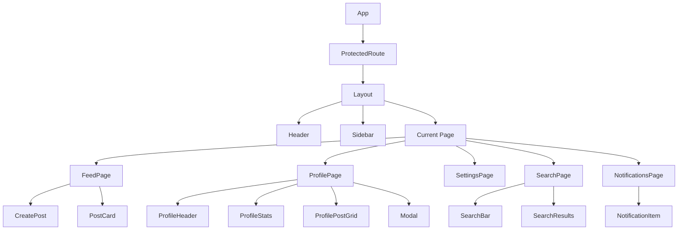
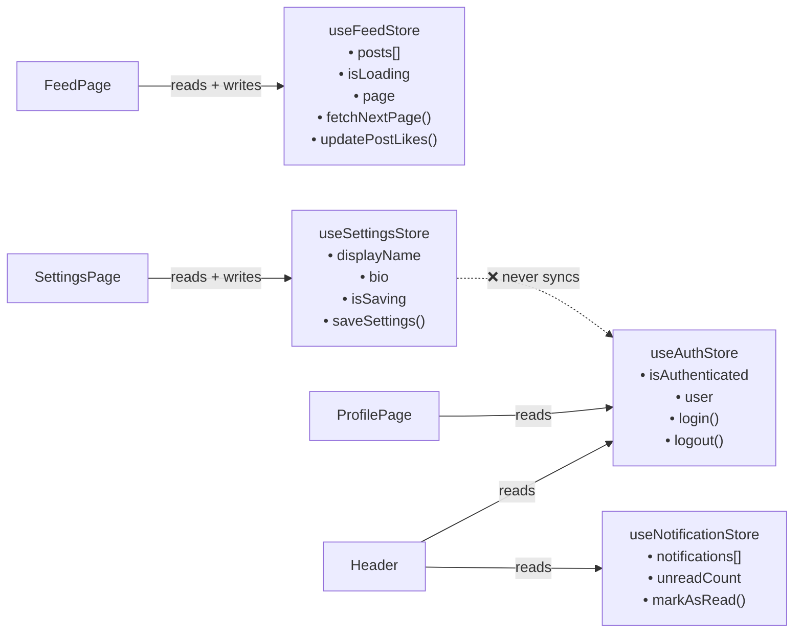
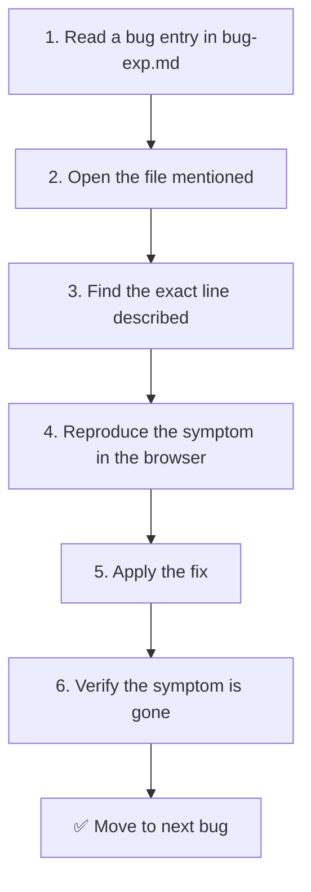

# 🔬 CodeSurgery — Bug Hunting Challenge

> A deliberately broken React app. Your job is to find and fix the bugs.

---

## 🤔 What Is This?

**CodeSurgery** is a fake social media app called **Nexus** — it looks polished, it loads fine, and it passes a quick glance. But hidden inside the code are **29 real bugs** that only show up when you actually use the app.

This is a **bug hunting competition**. You read the code, you use the app, you find what's broken, and you fix it.

Think of it like a puzzle — the app is the box, the bugs are the missing pieces, and `bug-exp.md` is your hint sheet.

---

## 🏆 The Competition

### What's the goal?
Find and fix as many bugs as possible. Each bug has a category, a severity, and a difficulty rating. Harder bugs are worth more.

### Where are the bugs documented?
All 29 bugs are listed in [`bug-exp.md`](./bug-exp.md) at the root of the project. Each entry tells you:
- Which **file** the bug is in
- What the **symptom** looks like

### Bug Categories
There are 7 categories of bugs:

| # | Category | What it means |
|---|----------|---------------|
| 1 | Rendering | Components not updating when they should |
| 2 | State Management | Data getting out of sync between parts of the app |
| 3 | CSS / Layout | Things visually breaking or overlapping |
| 4 | Performance | The app being slow or leaking memory |
| 5 | Data | Wrong data being shown (missing items, duplicates) |
| 6 | Event Handling | Clicks, scrolls, and inputs behaving incorrectly |
| 7 | UX | The user experience being broken in subtle ways |

---

## 🗺️ How the App Is Structured

Here's a bird's-eye view of the whole project:

```
codesurgery/
├── src/
│   ├── pages/          ← Full page components (Feed, Profile, Settings, etc.)
│   ├── components/     ← Reusable UI pieces (buttons, cards, modals, etc.)
│   │   ├── feed/
│   │   ├── layout/
│   │   ├── notifications/
│   │   ├── profile/
│   │   ├── search/
│   │   ├── settings/
│   │   └── ui/
│   ├── hooks/          ← Custom React hooks (reusable logic)
│   ├── store/          ← Global state (Zustand stores)
│   ├── services/       ← Fake API calls + mock data
│   ├── utils/          ← Helper functions
│   └── types/          ← TypeScript type definitions
├── bug-exp.md             ← 📋 The bug list (your main reference)
└── package.json
```

---

## 🔄 How Data Flows Through the App

This diagram shows how a user action (like clicking "Like" on a post) travels through the system:



> ⚠️ **Bug alert:** There are bugs in both `PostCard.tsx` and `useFeedStore.ts` that break this exact flow. Can you spot them?

---

## 🧭 App Navigation Map



---

## 🏗️ Component Hierarchy

This shows which components live inside which:



---

## 🗄️ Global State (Zustand Stores)

The app uses **Zustand** for global state. Think of stores as shared memory that any component can read from or write to.



> The dashed red arrow is a bug — `SettingsStore` saves profile changes but never tells `AuthStore` about them, so the header still shows your old name.

---

## ⚙️ Setup — Getting the App Running

Don't worry if you've never done this before. Follow these steps one by one.

### Step 1 — Make sure you have Node.js installed

Open your terminal and type:

```bash
node --version
```

You should see something like `v18.0.0` or higher. If you get an error, download Node.js from [nodejs.org](https://nodejs.org) and install it first.

---

### Step 2 — Clone or download the project

If you have Git:

```bash
git clone <repo-url>
cd codesurgery
```

Or just download the ZIP and unzip it, then open a terminal inside the `codesurgery` folder.

---

### Step 3 — Install dependencies

This downloads all the libraries the app needs (React, Tailwind, etc.):

```bash
npm install
```

You'll see a lot of text scroll by — that's normal. Wait for it to finish.

---

### Step 4 — Start the development server

```bash
npm run dev
```

You'll see output like:

```
  VITE v8.x.x  ready in 300ms

  ➜  Local:   http://localhost:5173/
```

Open your browser and go to **http://localhost:5173**

---

### Step 5 — Log in

Use any email and password — the login is mocked (fake). It always succeeds.

```
Email:    anything@example.com
Password: anything
```

---

## 🧪 How to Hunt Bugs

Here's a simple process to work through the bugs:



### Tips for beginners

- **Start with Easy bugs** — C-1, C-3, D-1, D-3 are the most straightforward
- **Use your browser DevTools** — Press `F12` to open them. The Console tab shows errors, the Network tab shows API calls
- **React DevTools** — Install the [React DevTools browser extension](https://react.dev/learn/react-developer-tools) to see component state in real time
- **Read the Root Cause first** — Each bug in `bug-exp.md` tells you exactly what's wrong. You just need to find it in the code and fix it

---

## 📦 Tech Stack — What Each Tool Does

| Tool | What it does | Think of it as... |
|------|-------------|-------------------|
| **React** | Builds the UI from components | LEGO bricks for web pages |
| **TypeScript** | Adds type safety to JavaScript | Spell-check for your code |
| **Vite** | Runs the dev server and builds the app | The engine that powers everything |
| **Tailwind CSS** | Styles components with utility classes | Pre-made CSS you apply directly in HTML |
| **Zustand** | Manages global state | A shared notebook all components can read/write |
| **React Router** | Handles page navigation (`/feed`, `/profile`, etc.) | The app's GPS |
| **date-fns** | Formats dates | "2 hours ago" instead of a raw timestamp |
| **lucide-react** | Provides icons | A library of ready-made SVG icons |

---

## 📋 Available Commands

| Command | What it does |
|---------|-------------|
| `npm run dev` | Start the app locally for development |
| `npm run build` | Build the app for production (checks for TypeScript errors too) |
| `npm run lint` | Check the code for style/quality issues |
| `npm run preview` | Preview the production build locally |

---

## 📁 Key Files to Know

| File | Why it matters |
|------|---------------|
| `bug-exp.md` | The master list of all 29 bugs with descriptions and fixes |
| `src/App.tsx` | The root of the app — defines all routes |
| `src/store/useAuthStore.ts` | Handles login/logout state (has a critical bug) |
| `src/store/useFeedStore.ts` | Manages the post feed (has 2 bugs) |
| `src/pages/Feed.tsx` | The main feed page (has a scroll listener bug) |
| `src/components/feed/PostCard.tsx` | Individual post card (has a stale closure + performance bug) |
| `src/components/ui/Modal.tsx` | Reusable modal (has 2 bugs — z-index and scroll lock) |
| `src/hooks/useSearch.ts` | Search logic (has a race condition bug) |
| `src/services/api.ts` | All fake API calls (has an off-by-one bug) |

---

## 🐛 Bug Severity Guide

| Severity | Meaning | Example |
|----------|---------|---------|
| 🔴 Critical | App is unusable | Can't type in the login form |
| 🟠 High | Feature is broken | Feed shows duplicate posts |
| 🟡 Medium | Feature works but incorrectly | Notification count is always wrong |
| 🟢 Low | Minor annoyance | Sidebar gets cut off on small screens |

---

## ❓ FAQ

**Q: Do I need to know React to participate?**
A: Basic React knowledge helps, but `bug-exp.md` explains every bug.

**Q: The app looks fine when I open it — where are the bugs?**
A: Most bugs only appear when you interact with the app. Try: typing in the login form, scrolling the feed quickly, liking a post twice, opening and closing the profile modal, or changing settings and navigating away.

**Q: What if the app crashes?**
A: It shouldn't — all bugs are designed to be silent failures, not crashes. If you see a crash, check if you accidentally introduced a new bug while editing.

**Q: How do I verify my fix worked?**
A: Reproduce the symptom described in `bug-exp.md` before your fix, apply the fix, then try to reproduce it again. If the symptom is gone, you fixed it.
# codesurgery
